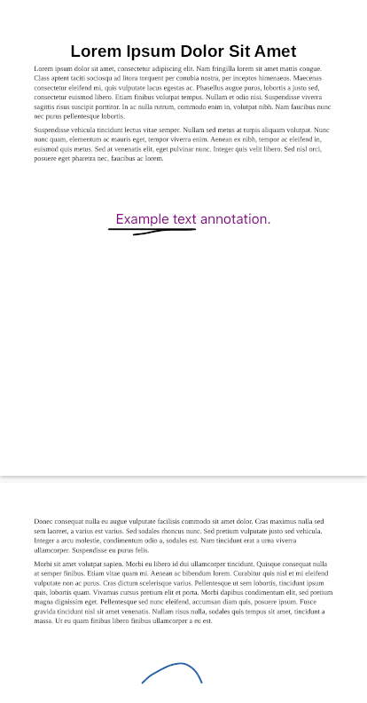
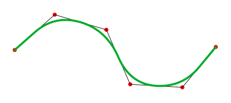

# Paged Annotation Simplified (PAS) Standard

The PAS standard describes a common format for storage and interchange of
document annotations. Supported annotation objects are strokes and text. The
minimal nature of this format allows for easy implementation and compact size.

See the `example.*` files in this repo for example usage.

# Version 1

A PAS file is a JSON array. Each element of the array represents annotations to
the corresponding page in the document.

```ts
type AnnotationFile = AnnotationPage[];
```

A page lists strokes and text.

```ts
type AnnotationPage = {
  strokes: Stroke[];
  text: PositionedText[];
};
```

Strokes are color, line width, and a sequence of points. Colors are hexedecimal
strings, of format compatible with HTML. Line width purposefully does not have
units. It should be treated similarly to display points. However, it is up to
the render implementation if the width should be scaled based on page zoom.

```ts
type Stroke = {
  color: string;
  width: number;
  path: Point[];
};
```

Text are color, size, location, and message. Colors are hexedecimal strings, of
format compatible with HTML. Font size purposefully does not have units. It
should be treated similarly to display points. However, it is up to the render
implementation if the font size should be scaled based on page zoom.

```ts
type PositionedText = {
  color: string;
  fontSize: number;
  point: Point;
  str: string;
};
```

Points are two-element arrays representing (x, y) coordinates. Coordinate values
are relative; (0, 0) represents the top left corner of a page, and (1, 1) the
bottom right corner.

```ts
type Point = [number, number];
```

## Example

```json
[
  {
    "strokes": [
      {
        "color": "#000000",
        "width": 2,
        "path": [
          [0.29688, 0.48177],
          [0.31641, 0.48177],
          [0.45424, 0.48177],
          [0.5106, 0.48177],
          [0.53739, 0.48177],
          [0.51842, 0.48289],
          [0.50112, 0.48289],
          [0.45592, 0.48289],
          [0.44252, 0.484],
          [0.42857, 0.48549],
          [0.41462, 0.48735],
          [0.40234, 0.48958],
          [0.38393, 0.49182],
          [0.3644, 0.4933]
        ]
      }
    ],
    "text": [
      {
        "color": "#810082",
        "fontSize": 16,
        "point": [0.31522, 0.4423],
        "str": "Example text annotation."
      }
    ]
  },
  {
    "strokes": [
      {
        "color": "#1d61a9",
        "width": 2,
        "path": [
          [0.38768, 0.42029],
          [0.40821, 0.40499],
          [0.43116, 0.39533],
          [0.45411, 0.38567],
          [0.47705, 0.38003],
          [0.50121, 0.37842],
          [0.52415, 0.38808],
          [0.53986, 0.40258],
          [0.54952, 0.41948]
        ]
      }
    ],
    "text": []
  }
]
```



## Renderer Implementation

When rendering strokes, consider using smooth strokes instead of rigidly
following the path. For example,



This option draws curves connecting midpoints in the path. The actual points of
the path are used as the curve control values.
